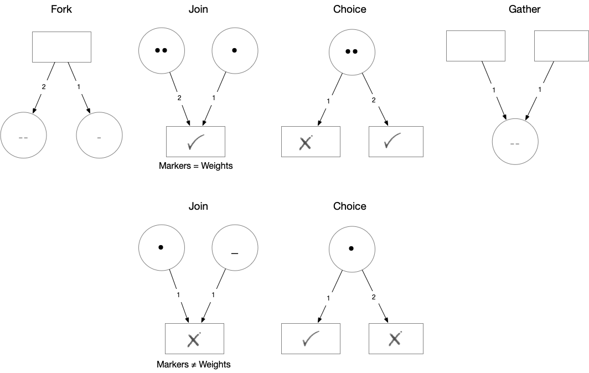

# ErgoHack III Proposal: Using a Colored Petri Net for Smart Contract orchestration and testing

## Implemention of Smart Contract Protocol specifications (EIP-0006)

I am proposing a project that uses Petri Nets as a tool to define and validate Smart Contract Protocol specifications (EIP-0006), for creation of headless dApps.

Formally, a Petri Net is a state transition graph that maps Places (circles) to Transitions (rectangles) and Transitions to Places via Arcs (arrows).
It is well suited for describing the flow of concurrent processes. This maps perfectly to the of Stages (Places) and Actions (Transitions)

Petri Nets are more concise than other process flow descriptions (like UML or BPMN) in that they have an exact mathematical definition of their execution semantics, with a well-developed mathematical theory for process analysis. Bounded Petri Nets exhibits Categorical Semantics in the way that **concatenable processes as strict Monoidal categories** model Net computations [[1]](#1) [[2]](#2)

Because of its Markov property - states depend only on the current marking -  Stochastic Petri Nets are also used for validating and testing the Liveness, Boundedness and Reachability of distributed networks.

From the proposal perspective, Petri Nets are directed graphs consisting of Places(Stages), Transitions(Actions) and Arcs(Transaction). It models state-transitions of (concurrent) processes.
It is easy to see (if you are that way inclined) that Petri Nets form a Category of Petri.  


We contend that there is a need to handle consecutive Smart Contract invocations (the dApp Protocol) within the context of a encapsulating state machine (FSM) as expressed by a Petri Net and executed by an off-chain dApp-container

An example of how to construct a PetriNet using a builder-pattern in Scala ( Using a Petri Net library (Castanet))

```scala
val p1 = Place(1, "start", 1)
val p2 = Place(2, "left", 3)
val p3 = Place(3, "right", 1)
val p4 = Place(4, "joint", 3)
val p5 = Place(5, "end", 1)

val t1 = Transition(6, "splitter", (l: LinkableElement) => println(l))
val t2 = Transition(7, "joiner", (l: LinkableElement) => println(l))
val t3 = Transition(8, "continuer", (l: LinkableElement) => println(l))

val b1 = PetriNetBuilder().addAll(ListSet(p1, p2, p3, p4, p5))
val b2 = n.addAll(ListSet(t1, t2, t3))
val b3 = n2
  .add(Weighted(1, 6, 1))
  .add(Weighted(6, 2, 1))
  .add(Weighted(6, 3, 1))
  .add(Weighted(2, 7, 2))
  .add(Weighted(3, 7, 1))
  .add(Weighted(7, 4, 1))
  .add(Weighted(4, 8, 3))
  .add(Weighted(8, 5, 1))
val petrinet = b3.build()
```

State is attributed to the Petri Net through Markers that associate a BitVector (scodec.bits) with a specific Place.
The setting of a bit is in turn determined by the success of the ErgoScript execution.

```scala
val m1 = Markers(pn)
val m2 = m1.setMarker(Marker(1, bin"1"))
val m3 = m2.setMarker(Marker(2, bin"1")).setMarker(Marker(4, bin"11"))
```


For a given set of Markers (current state) the PetriNet can be asked to step through to the next state (set of markers) as indicated by the guards placed on the Arcs that join Places and Transitions.

A ColouredPetrNet is traversable using a state monad to step from an initial state

The resulting state changes can be visualized with a PetriPrinter.

```scala
    PetriPrinter(fileName = "petrinet1", petriNet = pn).print(Option(m3))
    val steps: State[Step, Unit] =
      for
        p1 <- pn.step
        p2 <- pn.step
        p3 <- pn.step
      yield (
        PetriPrinter(fileName = "petrinet2", petriNet = pn).print(Option(p1)),
        PetriPrinter(fileName = "petrinet3", petriNet = pn).print(Option(p2)),
        PetriPrinter(fileName = "petrinet4", petriNet = pn).print(Option(p3))
      )
    steps.run(Step(m3, true, 1)).value
```


We derive the set of Transitions (Actions) from  ErgoScript files that controls  the business flow.
These Transitions are specified using a Dhall/JSON format list:

```dhall
[
  {
      id = 2 
    , name = "testTransition"
    , action = {
          packageName = "packageName1"
        , name = "contractName1"   
        , contract = 
          {
            name = "ergoScript1"
          , input = [inbox1, inbox2...]
          , output = [outbox1, outbox2...]
          } 
    }
    , action = {name = "contractName2"
          , input = "inbox3"
          , output = "outbox3"
          }
  }
]
```

Transitions change the States of the Workflow as described by a list of Places (Stages):

```dhall
  [{
    id = 1 
    , name = "place1"
    , capacity = 2
  }]
  ```

### Desired outcomes

1. A business analyst should  create a dApp Protocol by joining Places (States) and Transitions with Arcs
2. Configuration of a specific instance of a dApp can be programmatically created or be informed by the UI connecting to the headless dApp through a GRPC/HTTP API
3. Smart Contract templates will allow reuse and create a possible market place of tested Contracts
4. Validation of dApp can be done in terms of Liveness, Boundedness and Reachability
5. Design patterns will be supported by the Petri Net:


## References

<a id="1">[1]</a>
Sassone, V.. (2006). On the category of Petri net computation. 10.1007/3-540-59293-8_205

<a id="2">[2]</a>
Ermel, Claudia & Martini, Alfio. (1996). A Taste of Categorical Petri Nets. 