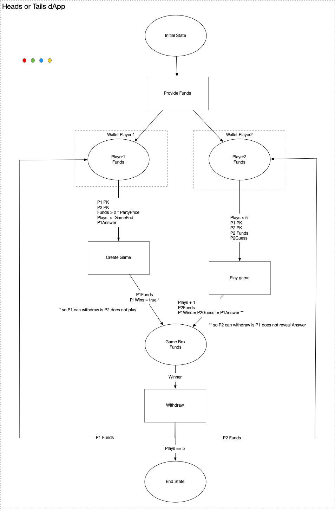

# ErgoHackIII: Ergo-Castanet - a Colored Petri Net for Smart Contract Orchestration and Testing

## Proposal

The core question that I am pursuing in this project is: How do you develop Decentralised Applications? I believe we require a way to compose dApps from Ergo Boxes - Wallets, Smart Contracts and Transactions, much like Functional Programming allows you to compose applications from pure functions.

With ErgoHackIII I wanted to test an intuition that the Categorical  (monoidal) aspects of Petri Nets lend itself to composing a dApp from the Boxes (Places) with guarding Contracts and  Transactions (Transitions).   I am basing this intuition on prior work I have done in creating an implementation of PetriNets (see https://github.com/iandebeer/castanet). It is a generalized implementation in Scala 3, developed with intent  to compose applications from Knative Services under Kubernetes.

As a starting point for ErgoHack, I used the "Heads or Tails Game" from the Ergoscript by Example repository (https://github.com/ergoplatform/ergoscript-by-example/blob/main/headsOrTails.md), to test the concept. I picked this example to render as a Petri Net because it has finite looping (5 plays) and forking and joining concepts. I want build this out so I can visualize this dApp, and then generalize the concept from there, to a point where one use it for dApp development by visualizing the stages, validating the flow, and running an instance of the dApp in the ErgoPlayground or through Appkit on the Ergo Blockchain.

I want to implement an Ergo-Castanet Client API over GRPC that will support:

```scala
val dAppID: String                = addDApp(flowSpec: org.ergoplatform.flow.spec.flowspec.FlowSpec)
val pngURL: URL                   = visualiseDApp(dAppID: String)
val animated_GIF_URL: URL         = validateDApp(dAppID: String ,markers: Seq(FlowMarkers)
val markerBitMap: Long            = excuteStepDApp(dAppID : String, markerBitMap: Long, transaction:ErgoTransaction)
```

Using the above API with the Head-or-Tails example I expect to visualize the dApp in the following Petri Net:



## Conclusion after ErgoHackIII-weekend

 I created a project on GitHub: https://github.com/iandebeer/ergo-castanet.  The project depends on another open source project I published on GitHub https://github.com/iandebeer/castanet 
 I implemented a GRPC client/server using the Typelevel FS2-GRPC framework. The protobuf I pulled from https://github.com/ergoplatform/ergo-appkit/tree/develop/docs/design-contracts.


 This allows me to build a request on the GRPC Client:

 ```scala
  def defineSpec() =
    // The game contract is created by the second player using the funds from the createGameTransaction
    // The output can be spent by the second player after the end of the game, if the first player fails to provide its secret and answer for the withdrawal
    // At any time, the winner can withdraw the funds providing the answer and the secret of the first player
    val gameScript = s""" 
                        | { // Get inputs from the createGameTransaction, this is the last box in the input list
                        |   val p2Choice = INPUTS(INPUTS.size-1).R4[Byte].get
                        |   val p1AnswerHash = INPUTS(INPUTS.size-1).R5[Coll[Byte]].get
                        |   val player1Pk = INPUTS(INPUTS.size-1).R6[SigmaProp].get
                        |   val partyPrice = INPUTS(INPUTS.size-1).R7[Long].get
                        |   val game_end = INPUTS(INPUTS.size-1).R8[Int].get
                        |   
                        |   // Get the outputs register
                        |   val p1Choice = OUTPUTS(0).R4[Byte].get
                        |   val p1Secret = OUTPUTS(0).R5[Coll[Byte]].get
                        |   
                        |   // Compute the winner (the check of the correctness of the winner answer is done later)
                        |   val p1win = ( p2Choice != p1Choice )
                        |   
                        |   sigmaProp (
                        |      // After the end of the game the second player wins by default
                        |      // This prevents the first player to block to game by not relealing its answer and secret
                        |     (player2Pk && HEIGHT > game_end) || 
                        |       allOf(Coll(
                        |         // The hash of the first player answer must match
                        |         blake2b256(p1Secret ++ Coll(p1Choice)) == p1AnswerHash,
                        |         // The winner can withdraw
                        |         (player1Pk && p1win )|| (player2Pk && ( p1win == false ))
                        |       ))
                        |   )
                        |  }
 """.stripMargin

    // The create game contract is created by the first player to engage the game
    // It allows to cancel the game and get a refund after the end of the game
    // At any time the funds can be spent by the second player if:
    //   The funds are protected by the game script
    //   The output value is more than twice the party price
    //   The R5 register contains the hash the the answer of the first player
    //   The R6 register contains public key of the first player
    //   The party price and game_end are unchanged from the initial contract
    val createGameScript = s""" 
      {
        val gameScriptHash = SELF.R4[Coll[Byte]].get
        val p1AnswerHash = SELF.R5[Coll[Byte]].get

        sigmaProp (
          (player1Pk && HEIGHT > game_end) ||
              allOf(Coll(
                  player2Pk,
                  blake2b256(OUTPUTS(0).propositionBytes) == gameScriptHash,
                  OUTPUTS(0).value >= 2 * partyPrice,
                  OUTPUTS(0).R5[Coll[Byte]].get == p1AnswerHash,
                  OUTPUTS(0).R6[SigmaProp].get == player1Pk,
                  OUTPUTS(0).R7[Long].get == partyPrice,
                  OUTPUTS(0).R8[Int].get == game_end
                ))
        )
      }
    """.stripMargin

    val name: String = "Coin Flip Game"
    val parameters = Seq(
      Param("playPrice", "Long"),
      Param("playPriceMinTxFee", "Long"),
      Param("playerFunds", "Long"),
      Param("gameDuration", "Long"),
      Param("playNumber", "Long")
    )
    val wallets: Seq[Wallet] = Seq(
      Wallet(
        "player1",
        "ergo script",
        Seq(Wallet.Box("standard", Option(ErgCondition("this", "script"))))
      ),
      Wallet(
        "player2",
        "ergo script",
        Seq(Wallet.Box("standard", Option(ErgCondition("this", "script"))))
      )
    )
    val transaction = Seq(
      Transaction(
        name = "createGame",
        inputs = Seq(InputArrow("p2Choice", "fromBox", Some(SpendingPath("action", "Condition"))))
      )
    )

    //val boxes: Seq[Wallet.Box] = Seq(new Wallet.Box("",None))

    FlowSpec(name, parameters, wallets, transaction)

```

The GRPC server will on receipt of the above request, create a Petri Net, as shown above.

the code can be tested by running  
```code
sbt server/run
```

and

```code
sbt client/run
```

And this is where I ran out of time.

I always realized that this project was not a normal Hackathon project and that the scope goes well beyond what a weekend will allow, but I wanted to:

 1. Bring this effort to the attention of the Ergo community and hopefully pique their interest; and
 2. Validate my intuition on the suitability of Petri Nets as a mechanism to compose dApps from Wallets, boxes and Transactions
  
Even though I feel disappointed at not being able to achieve more, I hope trust that I have achieved these goals I set.
I am eager to continue with this work and hopefully it will, in the near future, find a place in the ErgoPlatform eco-system.

